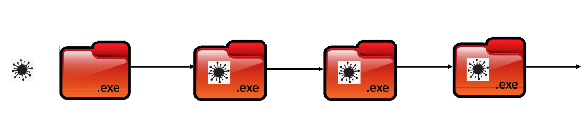

# Week2 

## The CIA Triad

<Mark>Threat</Mark> is an event that can cause negative impact to an organization. 

- ***Confidentiality*** is a set of rules that l<Mark>imits access to information.</Mark>

- ***Integrity*** is the ***assurance*** that the information is <Mark>***trustworthy and accurate***</mark>

- ***Availability*** is a guarantee of reliable <Mark>access to the information by authorized people.</mark>

## Threats and Attacks

### ***1. Malware***

***Virus***: replicates by attaching to some executable files; aims to modify files or damage systems

***Worm***: similar to virus, with the additional "stength" that is can survive and replicate on its own without the need to attach to  something else

-  Self replicating and exploring
-  May carry other payload
-  Causing congestion
-  May carry good intention
-  Taking actions without consent

***Trojan Horse***: disguises its real purpose and is installed by users inadvertently

***Ransomware**: a type of malicious software that threatens to publish the victim's data or perpetually block access to it unless a ransom is paid 

#### some quick questions
1. Which one of three doesn’t replicate itself? ***Trojan***
2. Which one can clog the Internet? ***Worm***
3. Which one(s) must “live off” other legitimate files? ***Virus and Trojan***
4. Which one spreads the fastest? ***Worm***

#### Countermeasure
1) Update OS and patches
2) Install antivirus software
3) don't download files from an untrusted network or website
4) Make sure your browser's set to request your permission 
before running pop-ups, files, or programs from the internet. 
5) Don't open files from people you don't know, or files from 
people who may not have a reason to message you directly
6) Regular backups of critical data must be made and stored 
on preferably read-only media such as CDs and DVDs.
7) Scan external storage devices on an isolated machine .

### Communication Interception

***Packet Sniffer***: Packet Sniffing is a technique of monitoring every packet that crosses the network

***IP Spoofing***: Modifies source address to spoof firewall

***Pharming***: Attackers use malware to change host file or perpetrate DNS Cache Posioning. Even Victim type correct URL. still go to wrong website and provides sensitive data to attackers.

***Man-in-the-Middle Attack*** :Attacker places him/herself in the middle of communication between 
two targets:
−e.g., by compromising the network routers in either/both targets’ networks
−May relay, modify, or even block communication contents entirely
#### some quick questions
Which one is the hardest to detect but easiest to defend against? ***Sniffing***

#### Countermeasure
firewall/intrusion detection system/prevent malware be installed

### Social Engineering 

Phishing Emails: Fake Email
Vishing : Fake Voice 
These are Social Engineering :
The use of deception to manipulate individuals into divulging confidential or personal information that may be used for fraudulent purposes

#### Countermeasure
- Conduct regular phishing  awareness programs and simulation  for all staff
- Maintain a principle of least  privilege for each user group and  account. 
- Remove or disable commonly  abused and non-essential services,  if appropriate. 

### Software Flaw

***SQL Injection*** :When developers fail to properly validate user input before using it to query a relational database, one may gain access to unauthorized information

***Buffer Overflow***: A buffer overflow, or buffer overrun, occurs when more data is put into a fixed-length buffer than  the buffer can handle. The extra information, which has to go somewhere, can overflow into adjacent memory space, corrupting or overwriting the data held in that space.

This overflow usually results in a system crash, but it also creates the opportunity for an attacker to run arbitrary code or manipulate the coding errors to prompt malicious actions.

Assembly and C/C++ more danger since direct access to memory

#### Countermeasures
Hire better IT team/Increase IT budget

### Service Disruption
***DoS***: disrupts service provision and so business continuity by making a server “busy” by send thousands of false requests to “flood” a server so that it cannot respond to other legitimate users

- Common Dos: 
    
    SYN Flooding exploits TCP three-way handshake feature to establish connections

    1. Malicious client not sending ACK back to server
    2. SYN request started by a spoofed IP address

***Distributed DoS (DDoS)***: More sophisticated 
attacks involve distributed zombies, hence the name DDoS

#### Countermeasures
Largely technical/Work with reliable  cloud service  providers, ISP, and police

### Others

***Password Cracking***
1. Guessing - Birthday, Id, Name, etc
2. Dictionary attack – repeatedly try dictionary words until access is granted
3. Brute-force attack - all cobinations 
4. Rainbow table - a precomputed table for reversing cryptographic hash function, usually for cracking password hashes. Tables are usually used in recovering a password up to certain length consisting of a limited set of characters

#### Countermeasures?

***Sabotage or Vandalism***:Involve deliberate sabotage of a computer system or acts of vandalism to destroy an asset or damage the image of an organization. 

***IoT and IIoT***:These are the systems in which failure often results in life-threatening or other 
emergency situations.

***Cryptojacking*** : Cryptojacking is a type of 
cybercrime where a criminal secretly uses a victim's computing power to generate cryptocurrency.

### Emerging Threats###
***Supply Chain Attack***: attack the supplier sysmtem of a company

***Generative AI***: AI attacks.e.g. deep fake

## CIA mapping 
