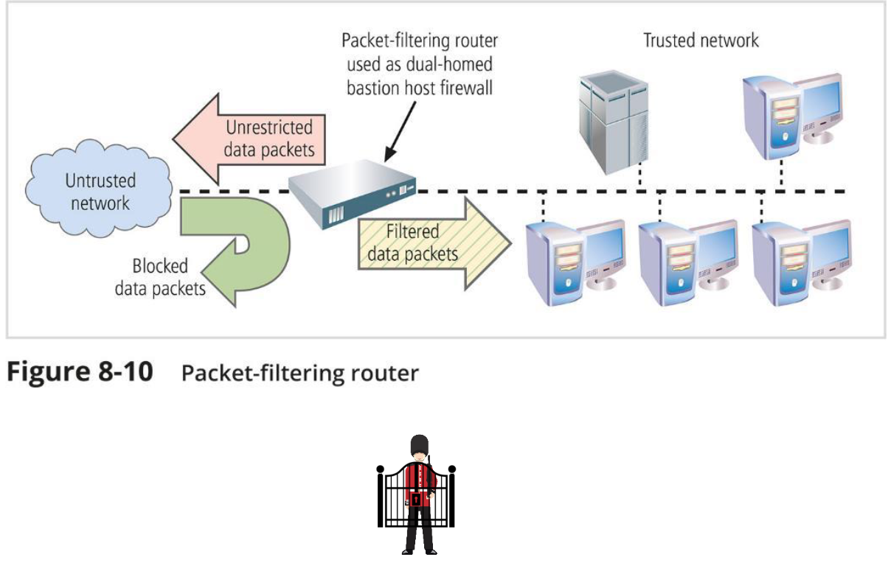
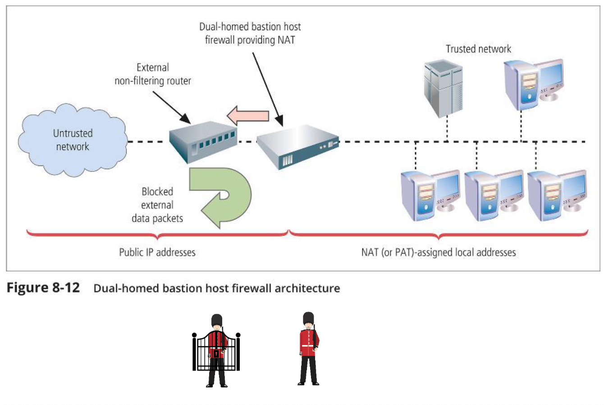
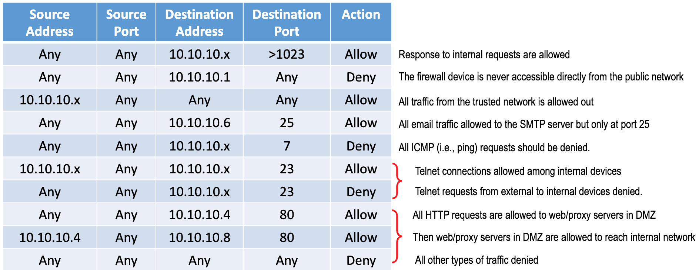

# Week3 - Protection Tools

•End-point protection (Antivirus/Antimalware/Patches/Upgrades)
## 1. Authentication method (access control)
    - Something you know
        1. Password, security questions
    - Something you have
        1. Token, SMS, ID card
    - Something you are or can produce
        1. Signature, retina scan, facial recognition, voice

***combine methods across categories to construct 2-factor authentication.***

## 2. Firewall

A specific type of computing facility to control network traffic, and keep your  organization’s internal network (or other  devices, data, applications, etc.) safe  from outside threats
    
- Regulates all inbound traffics, outbound traffics
- Can be implemented as hardware or software

### Firewall Architecture

1. Single Bastion Hosts

2. Dual-homed Bastion Host 

3. Screened Subnet 

4. Screened Subnet with DMZ (Demilitarized Zone)

### OSI 

### Type of firewall
MAC Layer Firewall (Media Access Control)
- filter by Mac address

Packet Filtering Firewalls

UDP and TCP header itself has some information about the src port and Dst port

1. Most basic form of firewall protection
2. Accept/reject data packets based on the packets’ header information 
    - Source and destination IP addresses via an access control list (ACL) (i.e., firewall rule set)

3. Efficient and low cost as it only examines header information of packets
4. No concept of “state” of packets, which makes it less secure
5. Has no way of knowing if any given packet is part of an existing connection, 
is trying to establish a new connection or is just a rogue packet

- Rule example: 

- Common Port Numbers:

Example

Question on Firewall:
1. Does encrypted traffic affect how firewall works? - no
2. How many rules do you think there will be? –from a few hundreds to a few thousands and even more, depending on the size of the organization
3.Will inbound rules be different from outbound rules? - yes
4. What should be the last rule? –deny all
5. Subject to what type of attack? –spoofing attack

Stateful Firewall (Dynamic Packet Filtering)
Keep track of connection status using a state table and a firewall ruleset

1. Accept traffic from the outside that matches an existing entry in the dynamic state table
2. Could be slower than packet filtering firewall
3. Far more secure than packet filtering firewal
4. Additional processing cost in order to maintain the state table

Application Layer (Proxy) Firewall

1. Sits between the internal network and the outside servers and gateways; serves as an intermediary that allows two systems to communicate indirectly; Hides internal network configuration
2. Typically installed in a dedicated computer separate from the filtering router
3. Allow or deny incoming traffic related to applications or services, such as web or FTP
4. Checks IPs; validates TCP handshakes; deep packet and stateful inspections; audit and logging; user authentication

## 3. IDPS
Intrusion detection (prevention) system –detection, reaction, correction, and prevention

How does IDS differ from a firewall?
- Firewall: security guards (gatekeeper)
- IDS: detective (traffic analyzer)

### Stateful Protocol Analysis (SPA)

Stores and uses relevant data detected in a session to identify intrusions involving multiple requests/responses and allows IDPS to better detect specialized, multisession attacks (also called deep packet inspection)

Drawbacks are analytical complexity, heavy processing overhead, and failure to detect intrusion unless protocol violates fundamental behavior.

### Differences Between Firewall and IDPS

| Firewall                      | IDPS                                                     |
|-------------------------------|----------------------------------------------------------|
| Only examines header          | Examines header and payload                              |
| Sits at perimeter of a networ | Sits between firewall and trusted network                |
| Block packets by IP/port      | Analyze packets, signal alarm and(drop, alert, or clean) |
| Rule-based                    | Rule-based or anomaly-based                              |
| Like a doorman                |                                                          |
| Easier to implement           |                                                          |
| Like a patrol or a bodyguard  |                                                          |
| More complex configuration    |                                                          |

### Detection Methods
1. Signature-based –match traffic or data patterns with pre-defined or known attack (suspicious) patterns
2. Statistical anomaly-based –sample network activities and compare them with “normal” baselines

Which one triggers more alarms? Statistical anomaly-based

### IDS Modes

- Passive
1. Analyze and report the information/problem (i.e., generate alarms) that it has collected
2. Does not interfere with the traffic itself
3. Wait for administrator’s actions

- Active
1. Automatically initiate responses when alerts are triggered e.g., collect and archive additional information, modify the environment, take action against the intruders, etc.

What if the traffic is encrypted? –greatly affects the IDPS’s ability to identify malware
What if there is heavy network traffic? –IDPS can cause network congestion and negatively impact the network’s performance

## 4. Honeypots

- Honeypots: decoy systems designed to lure potential attackers away from critical systems

- Honeynets: several honeypots connected together on a network segment

Honeypots are designed to:
- Divert an attacker from accessing critical systems
- Collect information about the attacker’s activity
- Encourage the attacker to stay on a system long enough for administrators to 
- document the event and perhaps respond

### Potential issues:

- Legal implications unclear
- Attackers may get angrier and launch more serious attacks
- High level of expertise required for admin

## Overall 

## 5. VPN

1. Extends an organization’s internal network to remote locations
2. Provide private and secure network connection between systems
3. VPN must accomplish (CIA):
- Confidentiality: the carrier network will route the data, but unable to decrypt it (through encryption).
- Integrity: messages transported across the network cannot be changed easily while they are in transport (through encapsulation).
- Authentication: users from both ends need to authenticate themselves, to be able to use the network (through passwords, keys, digital signatures, etc.).

### Tunnel Mode

- Establishes two perimeter tunnel servers to encrypt all traffic that will traverse an unsecured network
- Entire client package encrypted and added as data portion of a packet from one tunneling server to another

### Transport Mode VPN

- Data within IP packet are encrypted, but header information is not
- Allows user to establish secure link directly with remote host, encrypting only data contents of packet
- Two popular uses:
1. End-to-end transport of encrypted data
2. Remote access worker connects to an office network over Internet by connecting to a 
VPN server on the perimeter

## 6. Next Generation Firewall

•Cryptography
