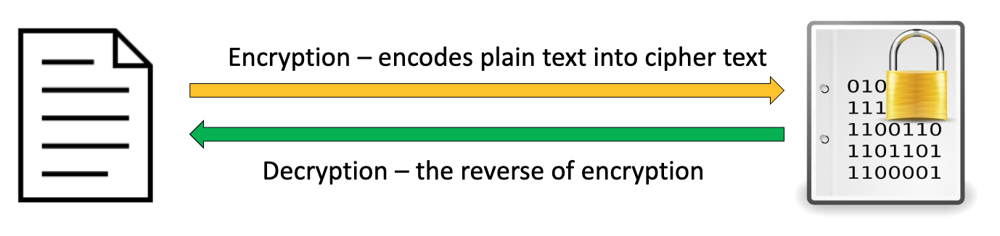

# Week4 - Cryptography

## 1. What is cryptography
Cryptology – the science of encryption

1. Cryptography – the process to keep a message secret from unintended audiences
2. Cryptanalysis – the process to obtain original text from encrypted message without knowing the methods/keys
## 2. Cipher Methods

### - Substitution (1-2)

#### Mono-alphabetic substitution 
e.g., Caesar cipher (shift each character position by 3 places to the right)
Example:

Key: positions to shift (K = 3)

##### How to crack?
Use frequency chart to improve efficiency of decryption

#### Poly-alphabetic substitution 
Example:

### - Transposition (3-4)
#### Transposition
Caesar block: fit the text to a number square (e.g., 5 by 5)
Example:

#### How to crack?
(Are bigger squares harder to crack?)
- Block size does not directly affect the security of the cipher. However, if block size is too small, it is not effective

#### Block Transposition
Since we have ASCII Code (Binary Code), we could transfers text to binary code and do the encrypt 
Example 

8-bit blocks are strong enough? No. longer stronger

### - User-generated key (5-6)
#### The Vigenère Square

Which letter shall not be used as part of the key? –A
#### Exculsive Or
1. Substitution by the XOR function with a user-chosen key
2. The key can be of different lengths

## Review questions:

Encryption Algorithm and Key Size which is more important and why? - Size
−What’s the key for each method?
• For mono-alphabetic, the key is number of key shifted 
• For poly-alphabetic, the key is dictionay
• For Caesar block, the key is block
• For transposition, the key is Shift the values within a block of text
• For the other two methods, the keys are encryption key
−What do you need to pass on to the recipient in order for him or her to decipher? Ciphered and Key
## 3. Hash
1. Hash functions are mathematical algorithms used to confirm the identity of a specific message and confirm that the content has not been changed
2. It does not create cipher text, instead generates a hash value or message digest.
3. Hash is not revertable 

### Hash characteristics
1. One way and irreversible  
2. Same data -> Same hash!
3. A small change in data -> A big change in hash values
4. Uniqueness -> impossible to find two messages with the same hash values 
(hash collision) 

### Collision Attack

For example, if the attacker was offering a file download and showed the hash to prove the file’s integrity, he could switch out the file download for a different file that had the same hash, and the person downloading it would be unable to know the difference. The file would appear valid as it has the same hash as the supposed real file

### Hash Collision 
In hashing, a hash collision occurs when two different inputs produce the same hash value as output. 

### Using case 1 : Hash for Password Protection

Instead of storing pain-text passwords, their hash values are stored on Web servers.  So intruders can’t see the original password or reverse it. 

Inputted password’s hash value will be compared with the stored hash value to verify.

Would longer or more complex pw still be useful? 
- not from a pure technical perspective, but still 
helpful as it will cost the hackers more to include 
longer passwords in a lookup table.

#### Rainbow Rable

Rainbow Tables are a compromise between a lookup table and low memory usage. The magic in Rainbow Tables is a basically a reduction function.

#### Hash with salt

The salt is typically stored right next to the salted and hashed password. Additionally, the salt should be unique per password.

### Using case 2: Hash as Message Digest 

Does this process ensure confidentiality and integrity? – Only integrity.

Subject to what types of attack? – sniffing, spoofing and man-in-the-middle.