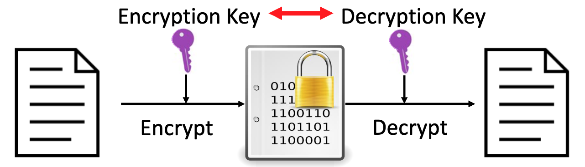
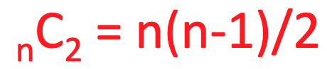
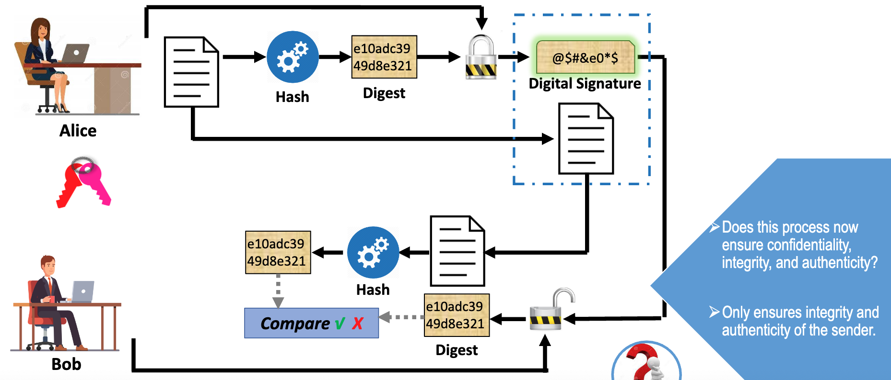
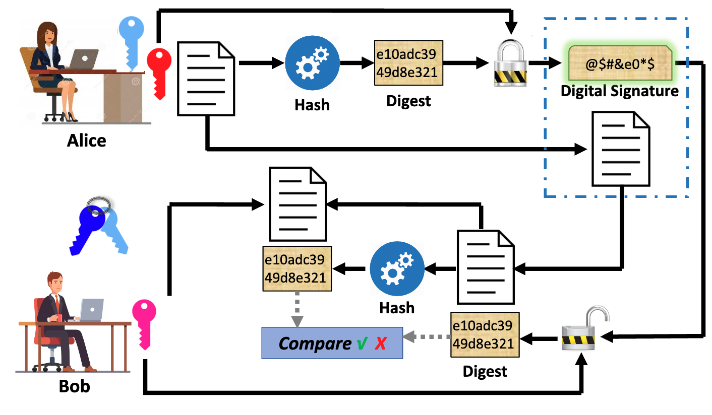
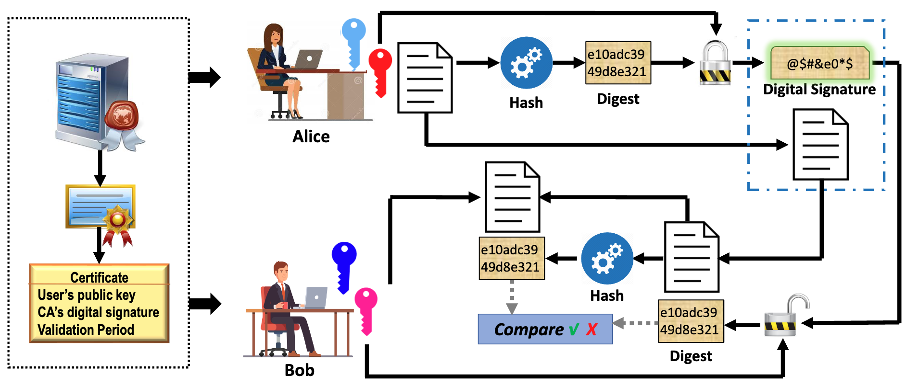
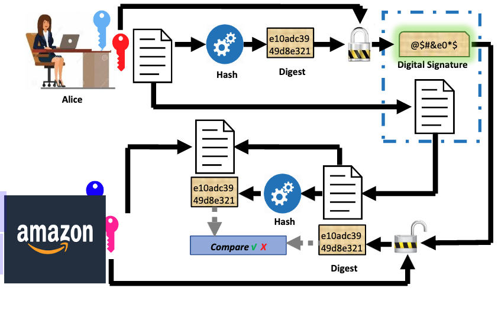
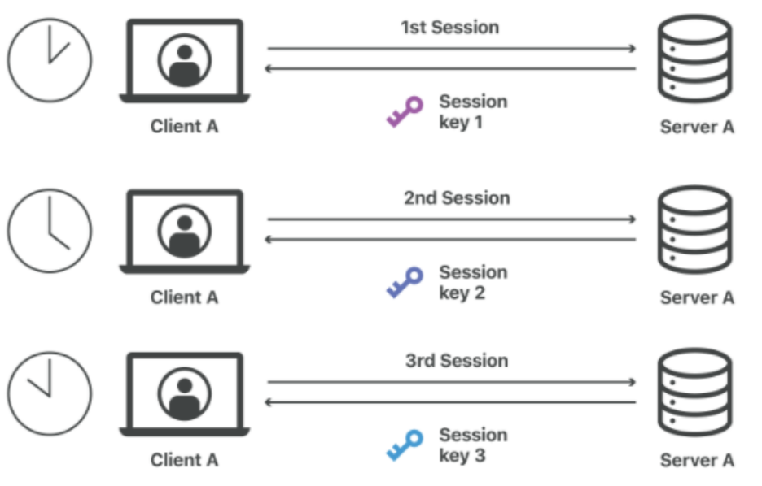
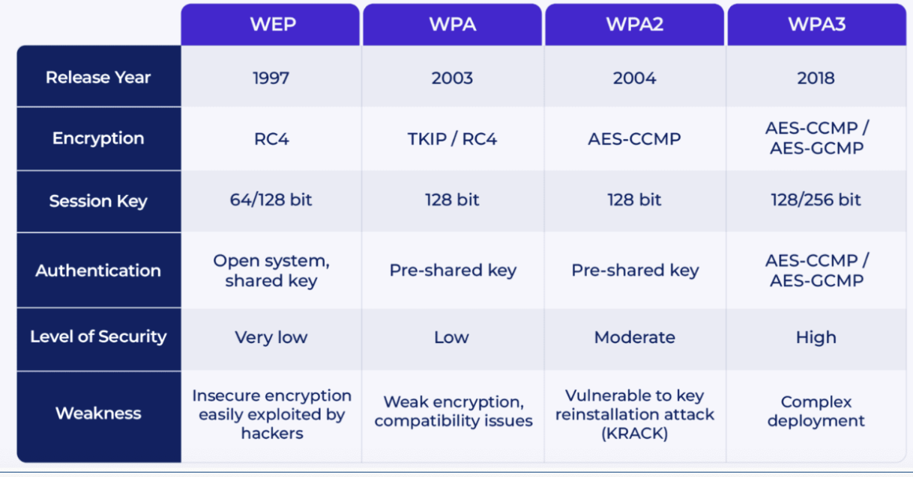

# Week5 - PKI

Why Cryptography
1. Confidentiality –unauthorized people should not see the message
    - “Who should see the information?”

2. Integrity –the message is not tampered with during thetransmission
    - “Did anyone change the information?”

3. Authenticity –verify the identity of the person who sent and receive the information

    - “Who sent and who received the information?”

4. Non-repudiation –prevent someone from denying a transaction

    - Can someone deny that he/she had sent a message earlier?”

## 1. Symmetric encryption
Same key for both encryption and decryption (hence “symmetric” or “secret”)

## Symmetric Key Implementation
1. Data Encryption Standard (DES)
- Block cipher developed by IBM; endorsed by US government in 1977
- 56-bit key on 64-bit data block
- 16 rounds of permutation, character substitution, and XOR operation
- Brute force attack, in 1998, US$250,000 hardware 3 days
2. Advanced Encryption Standard (AES)
-  Federal Information Processing Standard (FIPS) cryptographic algorithmic for use within the US government 
-  Key lengths of 128, 192, or 256 bits (AES-128, AES-192, and AES-256); 
-  9-13 rounds of operations involving substitution, transposition, XOR, and matrix multiplication
3. RC4: 
- A stream cipher with a 40 to 2048-bit key. It generates a keystream by using index. 
- Used in Secure Sockets Layer (SSL) and Transport Layer Security (TLS) with the Hypertext Transfer Protocol over SSL (HTTPS) protocol; and WEP and WPA on wireless networks.
4. RC5:
-  It is a block cipher  using a 1 to 255 round (12 originally suggested) Feistel-like network with 32, 64, or 128-bit blocks published in 1994. The key size is 0 to 2040 bits. Also uses modular addition and bitwise XOR

## Symmetric Key Cryptosystem
Symmetric Key Cryptosystem
•No. of keys needed with n parties

| Advantage                             | Disadvantage                      |
|---------------------------------------|-----------------------------------|
| Fast operation                        | Key distribution and management   |
| Simple                                | Fast operation   easier to break |
| Theoretically strong if key is secure |                                   |

What if the key is lost? The security will break down.

## 2. Asymmetric encryption - Public Key Infrastructure (PKI)
Use two different but related keys: a private key and a public key. Either key can be used to encrypt a message, but then the other key is required to decrypt it

### Asymmetric Key Systems
A key pair for each person 
- One as a public key – open for public access
- The other as private key –restricted to owner
- Deriving the private key from the public key alone is not possible!

### Public Key Cryptosystem
Foundation: mathematics! e.g. Factoring a product of two large prime numbers is extremely challenging

### 
Public Key Infrastructure (PKI)
| Benefits                                                          | Weakness                           |
|-------------------------------------------------------------------|------------------------------------|
| Easier key management and distribution                            | Slow to generate fresh strong keys |
| The private key is never distributed and therefore is more secure | Slow to encrypt                    |
| Scalable                                                          |                                    |

** There are no published methods to defeat the system if a large enough key is used.

### Digital Signature of Sender 

### PKI with Digital Signature  

### Digital Certificate
How to ensure the validity of someone’s public key?

A digital certificate is an electronic document that contains a public key value and identifying information about the entity that controls the key.

Often issued by a third party, i.e., a certificate authority (CA). 

### PKI with Digital Certificate

## Hybrid system
Asymmetric key algorithm is used to verify the identity of the owner and its public key. 

Once connection is built, symmetric key (session key) is used to encrypt and decrypt all following traffic between the two parties. 

## Protocols for secure communication
| Environment    | Protocols            |
|----------------|----------------------|
| Web (https://) | SSL, TLS             |
| Email          | S/MIME, PEM,  PGP    |
| Wireless       | WEP, WPA, WPA2, WPA3 |
| Bluetooth      | Passkey only         |
### SSL/TLS(HTTPS)

### PGP
Pretty Good Privacy (PGP) is a hybrid cryptosystem, available free or at low cost.

Becomes the open-source standard for encryption and authentication of email and file storage applications.

PGP uses ZIP to compress the message after it has been digitally signed, but before it is encrypted.
### WEP/WAP

### Bluetooth
1. Can be exploited by anyone with a range of approximately 30 feet (10 meters)
2. Do not accept an incoming communications pairing request unless you know the identity of the requester.
3. Avoid setting up pairing in public
3. Delete unused bluetooth connections
4. Disable bluetooth when not in use

