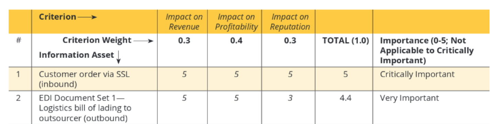
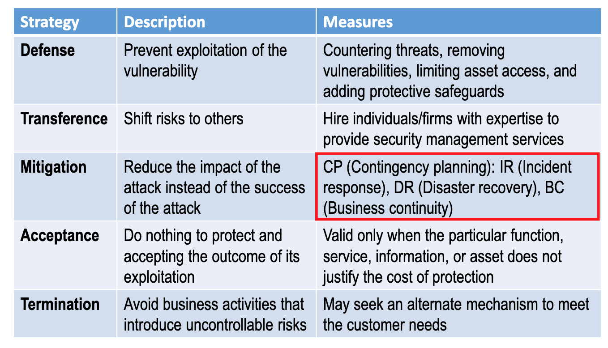

# Week4 - Risk Management;   Contingency Planning; Law

## Risk Management

### The Risk Management Framework

#### Risk identification
Need to ask the question above:
1. How critical is the asset to the success of the organization? 
2. How much does the information asset contribute to profit generation? 
3. How expensive is the information asset to replace? 
4. How expensive is the information asset to protect? 
5. How much embarrassment or liability would the asset’s loss or compromise cause?
Example:

#### Risk analysis: Identifying Vulnerabilities

####  Risk evaluation: Threats-vulnerabilities-assets (TVA) Workshee
A prioritized asset list maps to A prioritized threat list
Example: 

#### Risk evaluation: Quantitative risk assessment-

#### Risk treatment : Select Control Strategies

Which is the most passive strategy? Acceptance
## Contingency Planning  (CP)

1. In case of adverse events, there must be contingency plans in place.
2. To prepare the organization to anticipate, react to, and recover from events that threaten the security of information.

### NIST CP Methodology

NIST recommends using the following steps:
1. Develop the CP policy statement.
2. Conduct the BIA.
3. Identify preventive controls.
4. Create contingency strategies. 
5. Develop a contingency plan. 
6. Ensure plan testing, training, and exercises. 
7. Ensure plan updates and maintenance.

#### Business Impact Analysis(BIA)
It helps determine which business functions and information systems are the most critical to the success of the organization.
Maximum tolerable downtime (MTD) : The maximum time a business can tolerate the absence or unavailability of a particular business function 

System recovery time (RTO) : Time to recover system

Work recovery time (WRT) : Time to recover data/work

#### Incident Detection 

#### Incident Reaction

#### Disaster

Unable to mitigate the impact of an incident while it is occurring; and the level of damage is so severe that the organization is unable to recover quickly. 

•Recovery process similar to that of Business Continuity Planning (BCP)

#### Business Continuity Planning (BCP)
1. Hot sites: duplicate facilities
2. Warm sites: with computing equipment but not applications
3. Cold sites: Just a room with A/C and electricity. Might as well rent on spot. 
4. Time-shares: Few organizations to share a site
5. Service bureaus: a rental car clause in a car insurance policy
6. Mutual agreements: organizations help each other out when needed

#### Ensure plan testing, training, and exercises

## Digital Forensics
1. Identifying relevant items of evidence
2. Acquire the evidence without alteration or damage (special software and skills needed) 
3. Take steps to assure the authenticity and integrity of evidence at every step
4. Report findings to the proper authority